# FlipWise - Project Showcase & Overview

FlipWise is a full-stack flashcard web application designed to help users learn, practice, and memorize information efficiently. Similar to platforms like Quizlet, users can create custom study sets organized into folders, practice with interactive flip cards, track their learning performance, and browse public study decks created by the community.

### Default Test Credentials (from seeds)

To test the application locally with seeded mock data:
- **Email:** `user@example.com`
- **Password:** `user1234`

---

## 📖 What the Project Does

### 1. Interactive Study Mode
Users can study flashcards through an interactive card-flip interface. For each card, users evaluate their familiarity (1 = Hard, 2 = Medium, 3 = Easy), which updates their scoreboard and tracks their learning progress over time.

### 2. Folder & Flashcard Management
Organize flashcards into topical folders (e.g., Languages, Biology, Web Development). Each card supports a front prompt (question/term) and a back prompt (answer/definition).

### 3. Public & Community Decks
Users can publish their folders to make them publicly available to all learners or keep them private. Anyone can practice public decks, while creating and editing decks requires an account.

### 4. Authentication & Security
Full user authentication with Argon2 password hashing and JSON Web Tokens (JWT) for secure, stateless authorization on protected routes.

### 5. Dark Mode & Responsive Design
Built with Material-UI (MUI) providing seamless light/dark mode toggling and a fully responsive interface optimized for mobile and desktop screens.

---

## 🗄️ Domain Model & Database Schema

The database is built on MySQL using Knex migrations and seeds with relational integrity:

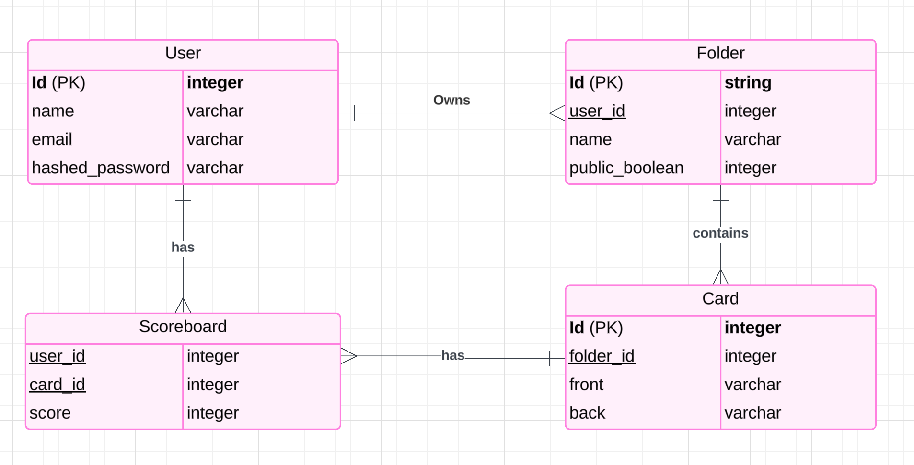

* **`user`**: Stores registered user accounts with securely hashed passwords (Argon2).
* **`folder`**: Grouping container for flashcards. Belongs to a user, with a visibility flag (`is_public`).
* **`card`**: The flashcard unit containing the front question and back answer, linked to a parent folder.
* **`scoreboard`**: Tracks user ratings and progress statistics for individual flashcards.

---

## 📸 Screenshots

### Home & Landing
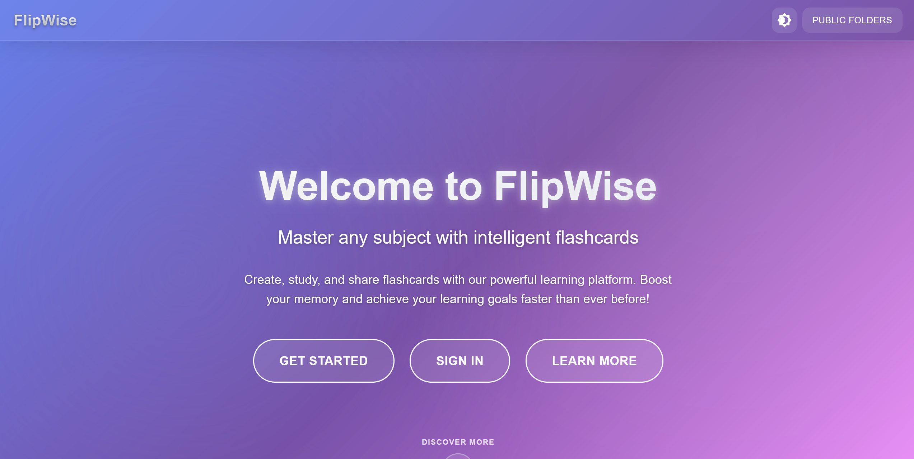

### About Page
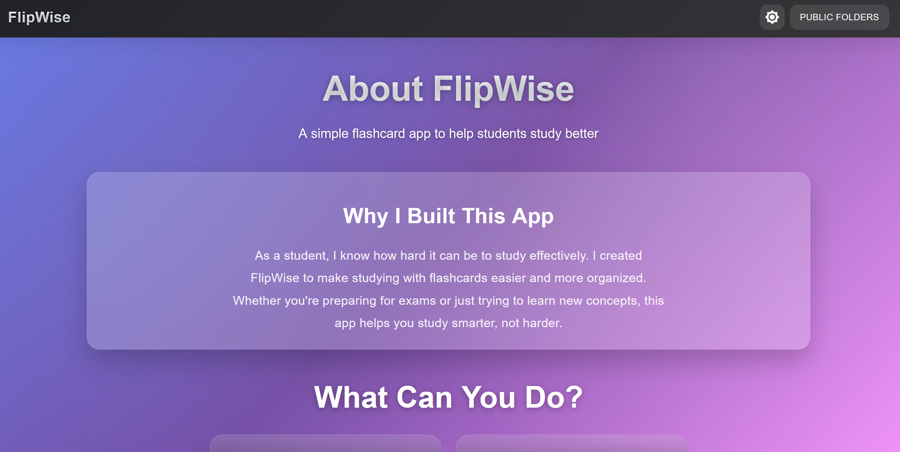

### Browse Public Study Folders

### Card Overview & Management

### Interactive Study Session
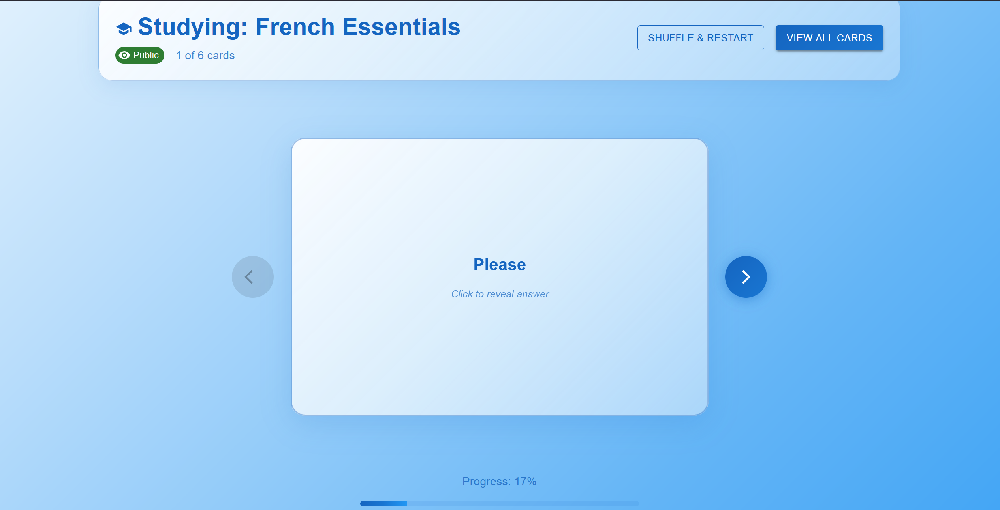

### My Folders Dashboard
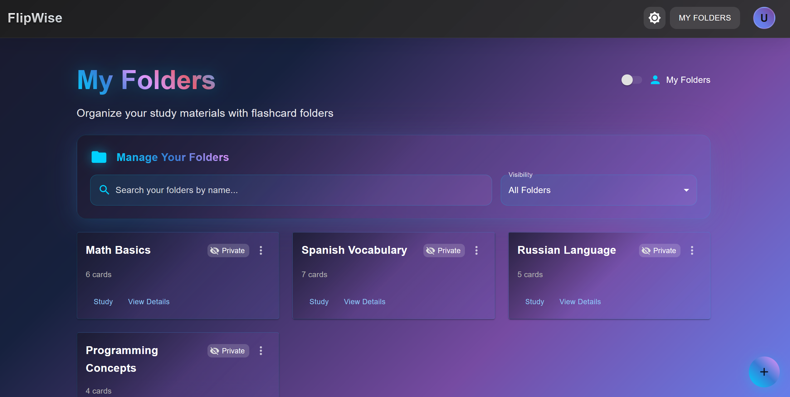

### Create Folder & Create Card
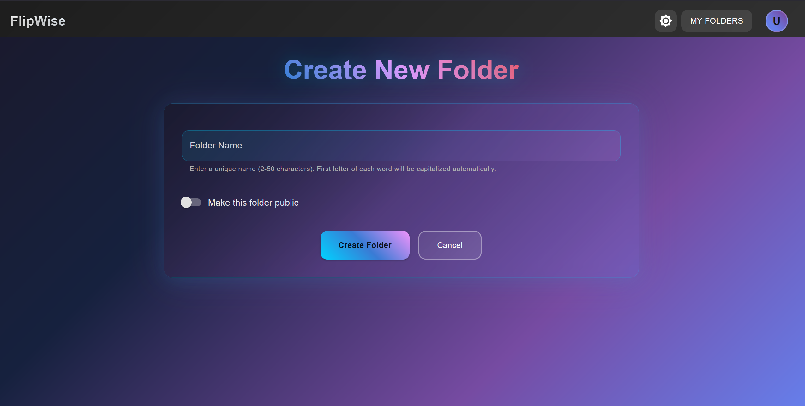
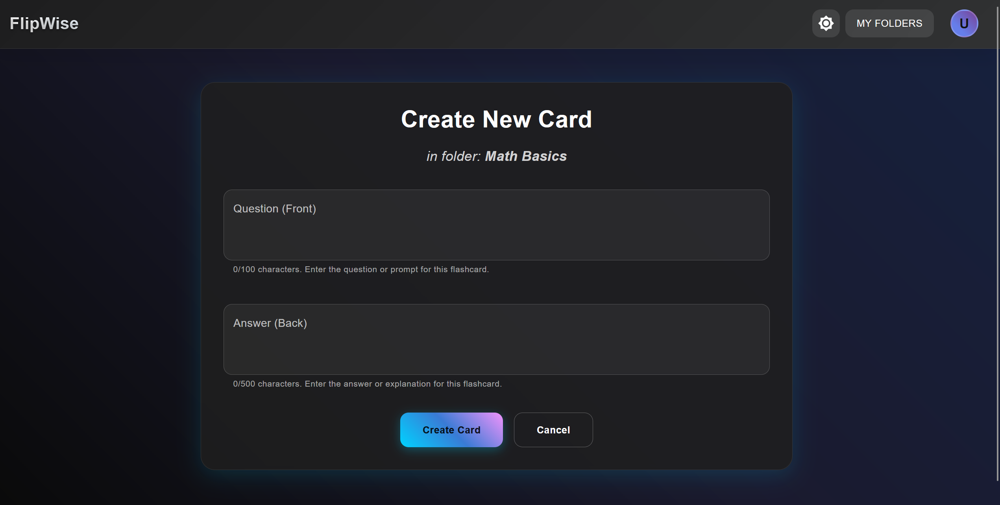

### Dark Theme Support
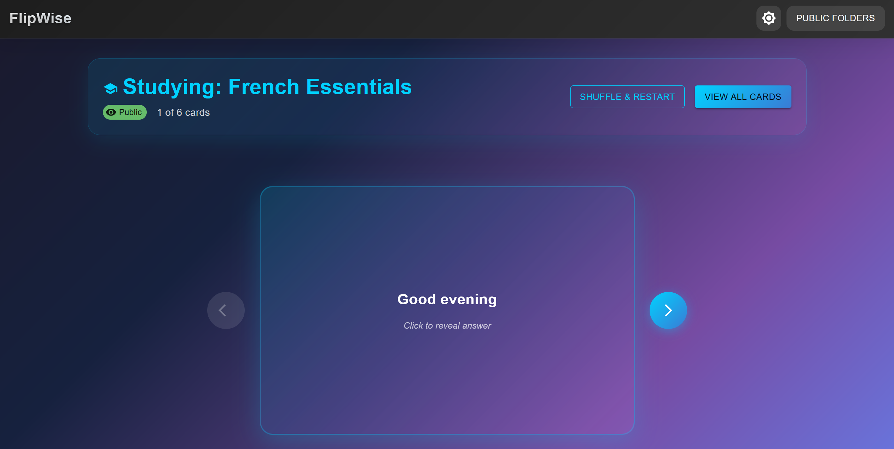

### Community & Public Library
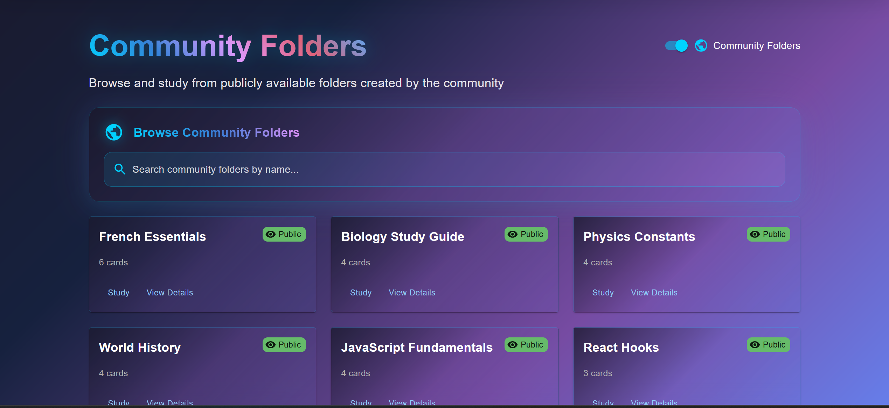

### Authentication
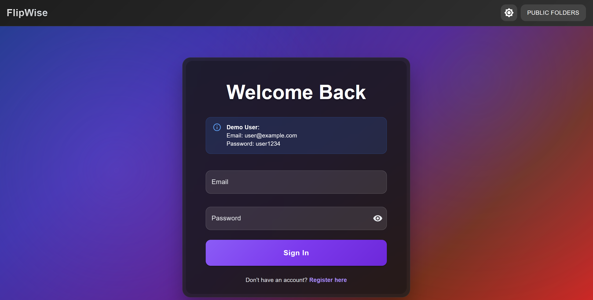
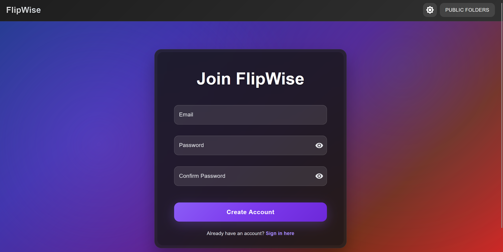

---

## 🌐 API Overview

The backend exposes a structured RESTful API with unified public and authenticated endpoints:

### Authentication
* `POST /api/auth/register` — Create a new user account.
* `POST /api/auth/login` — Authenticate and receive a JWT Bearer token.

### Public & Unified Folders
* `GET /api/folders` — List public folders (or both public and own folders if logged in).
* `GET /api/folders/:folderID` — View details of a folder.
* `GET /api/folders/:folderID/cards` — Retrieve all cards in a folder.
* `GET /api/folders/:folderID/cards/:cardID` — Retrieve a single card.
* `GET /api/folders/:folderID/cards/:cardID/scores` — Retrieve user study score for the card.
* `POST /api/folders/:folderID/cards/:cardID/scores` — Record a study score.
* `PUT /api/folders/:folderID/cards/:cardID/scores` — Update a study score.

### User Account & Personal Decks (Protected)
* `GET /api/users` — Get authenticated user profile.
* `PUT /api/users` — Update user profile.
* `DELETE /api/users` — Delete user profile.
* `GET /api/users/folders` — List folders created by the user.
* `POST /api/users/folders` — Create a new folder.
* `PUT /api/users/folders/:folderID` — Update folder metadata/visibility.
* `DELETE /api/users/folders/:folderID` — Delete a folder and its cards.
* `POST /api/users/folders/:folderID/cards` — Add a new card to a user folder.
* `PUT /api/users/folders/:folderID/cards/:cardID` — Edit a card.
* `DELETE /api/users/folders/:folderID/cards/:cardID` — Delete a card.

### System & Health
* `GET /api/health/ping` — Health check endpoint (`pong`).
* `GET /api/health/version` — Service version endpoint.

---

## 🧪 Testing & Quality Assurance

### End-to-End Testing (Frontend)
The frontend includes end-to-end tests written with **Cypress**:
* **`authentication.cy.js`**: Login, registration, form validation, and logout flows.
* **`folderManagement.cy.js`**: Folder creation, validation, inspection, and study mode launch.
* **`navigation.cy.js`**: Routing, unauthenticated route protection, 404 handling, responsive design.
* **`studyMode.cy.js`**: Flashcard flipping, scoring interactions, progress navigation.

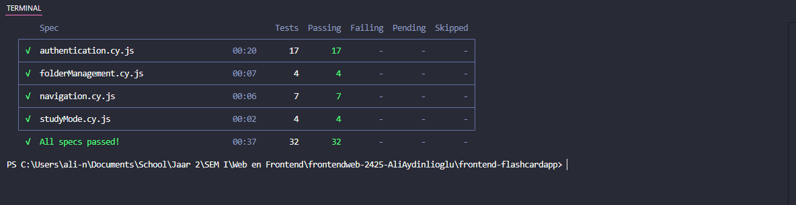

### Integration Testing (Backend)
The backend features an integration test suite built with **Jest** and **Supertest**, executing against an isolated test database schema:
* Authentication and JWT authorization tests.
* Full CRUD tests across users, folders, cards, and scores.
* Validation error verification on bad inputs.

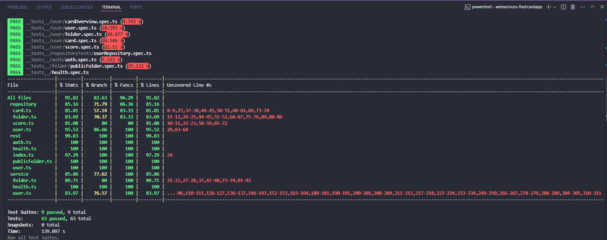
